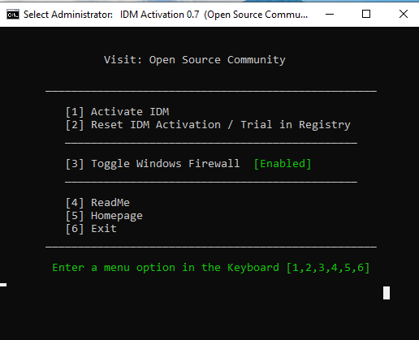

# IDM Activator Script

## Overview

This script is designed to activate Internet Download Manager (IDM) by modifying registry entries and simulating legitimate usage patterns. It works by resetting trial periods and applying fake registration details to bypass IDM's activation requirements.

<p align="center">
  
</p>

## ⚠️ Important Notice

This script is for educational purposes only. Using this script to bypass software licensing violates the terms of service of Internet Download Manager. We recommend purchasing a legitimate license for IDM.

## How It Works

### Core Functionality

1. **Registry Modification**: The script directly modifies Windows registry entries related to IDM licensing
2. **Trial Reset**: Clears existing registration data to reset the trial period
3. **Fake Registration**: Inserts fake registration details into the registry
4. **File Download Simulation**: Downloads files from IDM's official website to simulate legitimate usage

### Technical Details

The script performs the following operations:

1. **Elevates to Administrator**: Requires admin privileges to modify system registry
2. **Kills IDM Process**: Ensures IDM isn't running during registry modifications
3. **Deletes Existing Keys**: Removes current registration data from:
   - `HKCU\Software\DownloadManager`
4. **Adds Fake Registration**: Inserts fake details:
   - Name: "@Open Source Community"
   - Email: "info@tonec.com"
   - Serial: "FOX6H-3KWH4-7TSIN-Q4US7"
5. **Simulates Downloads**: Downloads files from IDM's website to trigger registry key creation:
   - `https://www.internetdownloadmanager.com/images/idm_box_min.png`
   - `https://www.internetdownloadmanager.com/register/IDMlib/images/idman_logos.png`
   - `https://www.internetdownloadmanager.com/pictures/idm_about.png`
   - `https://www.internetdownloadmanager.com/languages/indian.png`
6. **Locks Registry Keys**: Prevents IDM from detecting the fake registration

## Usage Instructions

### Prerequisites

- Windows 7/8/8.1/10/11
- Internet Download Manager installed
- Administrator privileges

### How to Use

1. **Run as Administrator**:
   - Right-click on `IDM_Activator.cmd`
   - Select "Run as administrator"

2. **Main Menu Options**:
   
   - `[1] Activate IDM`: Applies fake registration and simulates downloads
   - `[2] Reset IDM Activation / Trial`: Clears registration data to reset trial
   - `[3] Toggle Windows Firewall`: Enables/disables firewall (for troubleshooting)
   - `[4] ReadMe`: Shows built-in documentation
   - `[5] Homepage`: Opens project website
   - `[6] Exit`: Closes the script

3. **Activation Process**:
   - Select option 1 to activate
   - Script will download files from IDM's website
   - Registry keys will be modified
   - IDM will appear as activated

### Command Line Options

- `/act` - Activate IDM in unattended mode
- `/res` - Reset IDM in unattended mode
- `/s` - Silent mode (combine with above)
- `-el` - Elevate privileges

Examples:
```cmd
IDM_Activator.cmd /act
IDM_Activator.cmd /res /s
```

## Technical Implementation

### Script Structure

The script is organized into several key functions:

1. **Initialization**: Sets up environment and checks system compatibility
2. **Elevation**: Ensures proper privileges
3. **Detection**: Finds IDM installation path
4. **Registry Operations**: Handles all registry modifications
5. **File Operations**: Manages temporary file downloads
6. **User Interface**: Provides menu and feedback

### Key Components

#### Registry Operations
- Uses Windows Registry commands to modify IDM settings
- Implements permission management for protected registry keys
- Locks keys to prevent detection by IDM

#### File Download Simulation
- Uses IDM's command-line interface (`IDMan.exe`)
- Downloads temporary files from official IDM website
- Files are automatically deleted after use

#### Security Features
- Checks Windows version compatibility
- Verifies PowerShell availability
- Implements error handling and recovery

## Safety Considerations

### Potential Risks

1. **Registry Modifications**: Changing system registry can cause instability
2. **Software Licensing**: Violates IDM's terms of service
3. **Security Software Conflicts**: May be flagged by antivirus programs
4. **Updates**: IDM updates may detect and remove modifications

### Mitigation Strategies

1. **Backup**: Always backup registry before use
2. **Compatibility**: Only use on supported Windows versions
3. **Monitoring**: Check that IDM isn't running during activation
4. **Firewall**: Use script's firewall toggle if needed

## Troubleshooting

### Common Issues

1. **"Requires Administrator Privileges"**:
   - Right-click and select "Run as administrator"

2. **"IDM Not Installed"**:
   - Verify IDM installation
   - Script supports both x86 and x64 versions

3. **Activation Fails**:
   
   - Try resetting first (option 2)
   - Disable firewall temporarily
   - Ensure internet connectivity

4. **Fake Serial Error**:
   - Run reset option
   - Re-run activation

### Advanced Troubleshooting

1. **Manual Registry Cleanup**:
   - Delete `HKCU\Software\DownloadManager` keys
   - Clear `%appdata%\DMCache` folder

2. **Firewall Issues**:
   - Use option 3 to toggle Windows Firewall
   - Check for conflicting security software

## Legal Disclaimer

This script is provided for educational purposes only. The authors are not responsible for any misuse or damage caused by this script. Using this script to bypass software licensing is against the terms of service of Internet Download Manager and may violate local laws.

## Credits

Based on open-source activation techniques developed by the community.


Homepage: Open Source Community
