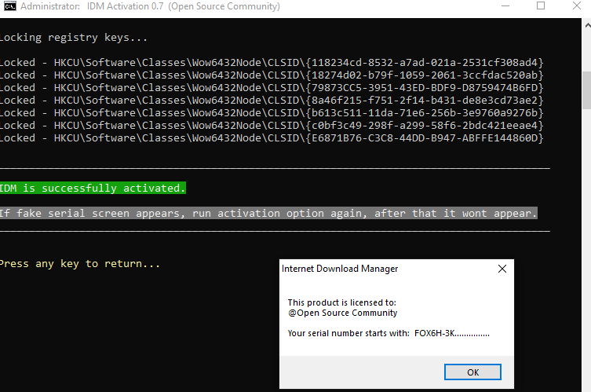

# IDM Activator Script

## Overview

This script is designed to activate Internet Download Manager (IDM) by modifying registry entries and simulating legitimate usage patterns. It works by resetting trial periods and applying fake registration details to bypass IDM's activation requirements.

**Version:** 4.0 (2025-10-26)
<!--
<p align="center">
  
</p>
-->
<p align="center">

</p>

## Installation

### Method 1: PowerShell

Open PowerShell:
- Right-click the Start menu and select Windows PowerShell or Windows Terminal
- If prompted by User Account Control (UAC), click Yes to allow PowerShell to run with administrative privileges

Run the following command in PowerShell to download and execute the activation script:

```powershell
irm https://raw.githubusercontent.com/its-anya/IDM-Activator/refs/heads/main/install.ps1 | iex
```

#### Troubleshooting Execution Policy Errors

If you encounter an execution policy error when running the script, you can temporarily allow scripts:

Option 1: Bypass execution policy for current process
```powershell
Set-ExecutionPolicy -Scope Process -ExecutionPolicy Bypass
```

When prompted, type "A" for "Yes to All", then re-run the script:

```powershell
irm https://raw.githubusercontent.com/its-anya/IDM-Activator/main/IDM_Activator.cmd | iex
```


### Method 2: Manual Download

1. Download: Obtain the latest version of the tool from the [releases page](https://github.com/its-anya/IDM-Activator/releases/)
2. Alternative direct link: [IDM_Activator.cmd](https://raw.githubusercontent.com/its-anya/IDM-Activator/refs/heads/main/IDM_Activator.cmd)

### Method 3: Using Launcher Script

1. Download the [IASL.cmd](https://raw.githubusercontent.com/its-anya/IDM-Activator/refs/heads/main/IASL.cmd) launcher script
2. Right-click on the downloaded file and select "Run as administrator"

### Method 4: PowerShell Installation Script

1. Download the [install.ps1](https://raw.githubusercontent.com/its-anya/IDM-Activator/main/install.ps1) script
2. Right-click on the downloaded file and select "Run with PowerShell"
3. If prompted by User Account Control (UAC), click Yes

## ⚠️ Important Notice

This script is for educational purposes only. Using this script to bypass software licensing violates the terms of service of Internet Download Manager. We recommend purchasing a legitimate license for IDM.

## How It Works

### Core Functionality

1. **Registry Modification**: The script directly modifies Windows registry entries related to IDM licensing
2. **Trial Reset**: Clears existing registration data to reset the trial period
3. **Fake Registration**: Inserts fake registration details into the registry
4. **File Download Simulation**: Downloads files from IDM's official website to simulate legitimate usage

### Technical Details

The script performs the following operations:

1. **Elevates to Administrator**: Requires admin privileges to modify system registry
2. **Kills IDM Process**: Ensures IDM isn't running during registry modifications
3. **Deletes Existing Keys**: Removes current registration data from:
   - `HKCU\Software\DownloadManager`
4. **Adds Fake Registration**: Inserts fake details:
   - Name: "@Open Source Community"
   - Email: "info@tonec.com"
   - Serial: "FOX6H-3KWH4-7TSIN-Q4US7"
5. **Simulates Downloads**: Downloads files from IDM's website to trigger registry key creation:
   - `https://www.internetdownloadmanager.com/images/idm_box_min.png`
   - `https://www.internetdownloadmanager.com/register/IDMlib/images/idman_logos.png`
   - `https://www.internetdownloadmanager.com/pictures/idm_about.png`
   - `https://www.internetdownloadmanager.com/languages/indian.png`
6. **Locks Registry Keys**: Prevents IDM from detecting the fake registration

## New Features Added

### Alternative File Replacement Method

In addition to the registry-based activation, the script now includes an alternative activation method that replaces IDM's core executable files:

1. **File Replacement**: Replaces [IDMan.exe](file:///c%3A/Users/rehan/Desktop/IDM_Activator/IDMan.exe) and [IDMGrHlp.exe](file:///c%3A/Users/rehan/Desktop/IDM_Activator/IDMGrHlp.exe) with modified versions
2. **Automatic Backup**: Creates backups of original files before replacement
3. **Registry Enhancement**: Applies additional registry settings from [registry.bin](file:///c%3A/Users/rehan/Desktop/IDM_Activator/registry.bin) if available
4. **Custom Registration**: Allows users to enter custom registration details

### Version Checking and Download

The script now includes features to check your IDM version and download the latest version:

1. **Version Comparison**: Compares your installed version with the latest available
2. **Direct Download**: Opens your browser directly to download the latest IDM version

## Usage Instructions

### Prerequisites

- Windows 7/8/8.1/10/11
- Internet Download Manager installed
- Administrator privileges

### Required Files for Alternative Method

For the file replacement activation method, you need these files in the script directory:
- [data.bin](file:///c%3A/Users/rehan/Desktop/IDM_Activator/data.bin) (replaces [IDMan.exe](file:///c%3A/Users/rehan/Desktop/IDM_Activator/IDMan.exe))
- [dataHlp.bin](file:///c%3A/Users/rehan/Desktop/IDM_Activator/dataHlp.bin) (replaces [IDMGrHlp.exe](file:///c%3A/Users/rehan/Desktop/IDM_Activator/IDMGrHlp.exe))
- [registry.bin](file:///c%3A/Users/rehan/Desktop/IDM_Activator/registry.bin) (optional registry settings)

### How to Use

1. **Run as Administrator**:
   - Right-click on `IDM_Activator.cmd`
   - Select "Run as administrator"

2. **Main Menu Options**:
   
   - `[1] Activate IDM (Registry Method)`: Applies fake registration using registry locking
   - `[2] Activate IDM (File Replacement Method)`: Replaces IDM executables with modified versions
   - `[3] Reset IDM Activation / Trial`: Clears registration data to reset trial
   - `[4] Check IDM Version`: Compares installed version with latest available
   - `[5] Download Latest IDM Version`: Opens browser to download latest version
   - `[6] Check Activation Status`: Verifies if IDM is currently activated without performing activation
   - `[7] Toggle Windows Firewall`: Enables/disables firewall (for troubleshooting)
   - `[8] ReadMe`: Shows built-in documentation
   - `[9] Homepage`: Opens project website
   - `[0] Exit`: Closes the script

3. **Activation Process**:
   - Select option 1 for registry method or option 2 for file replacement method
   - Script will download files from IDM's website (registry method)
   - Registry keys will be modified or files will be replaced
   - IDM will appear as activated

### Command Line Options

- `/act` - Activate IDM in unattended mode
- `/res` - Reset IDM in unattended mode
- `/s` - Silent mode (combine with above)
- `-el` - Elevate privileges

Examples:
```cmd
IDM_Activator.cmd /act
IDM_Activator.cmd /res /s
```

## Technical Implementation

### Script Structure

The script is organized into several key functions:

1. **Initialization**: Sets up environment and checks system compatibility
2. **Elevation**: Ensures proper privileges
3. **Detection**: Finds IDM installation path
4. **Registry Operations**: Handles all registry modifications
5. **File Operations**: Manages temporary file downloads
6. **User Interface**: Provides menu and feedback

### Key Components

#### Registry Operations
- Uses Windows Registry commands to modify IDM settings
- Implements permission management for protected registry keys
- Locks keys to prevent detection by IDM

#### File Download Simulation
- Uses IDM's command-line interface (`IDMan.exe`)
- Downloads temporary files from official IDM website
- Files are automatically deleted after use

#### Security Features
- Checks Windows version compatibility
- Verifies PowerShell availability
- Implements error handling and recovery

## Safety Considerations

### Potential Risks

1. **Registry Modifications**: Changing system registry can cause instability
2. **Software Licensing**: Violates IDM's terms of service
3. **Security Software Conflicts**: May be flagged by antivirus programs
4. **Updates**: IDM updates may detect and remove modifications
5. **File Replacement**: Replacing executable files may affect software functionality

### Mitigation Strategies

1. **Backup**: Always backup registry before use
2. **Compatibility**: Only use on supported Windows versions
3. **Monitoring**: Check that IDM isn't running during activation
4. **Firewall**: Use script's firewall toggle if needed
5. **File Backup**: The file replacement method automatically creates backups

## Troubleshooting

### Common Issues

1. **"Requires Administrator Privileges"**:
   - Right-click and select "Run as administrator"

2. **"IDM Not Installed"**:
   - Verify IDM installation
   - Script supports both x86 and x64 versions

3. **Activation Fails**:
   
   - Try resetting first (option 3)
   - Disable firewall temporarily
   - Ensure internet connectivity
   - Try the alternative file replacement method (option 2)

4. **Fake Serial Error**:
   - Run reset option
   - Re-run activation

5. **File Replacement Method Fails**:
   - Ensure [data.bin](file:///c%3A/Users/rehan/Desktop/IDM_Activator/data.bin) and [dataHlp.bin](file:///c%3A/Users/rehan/Desktop/IDM_Activator/dataHlp.bin) files are in the script directory
   - Check that IDM is properly installed
   - Verify you're running as administrator

### Advanced Troubleshooting

1. **Manual Registry Cleanup**:
   - Delete `HKCU\Software\DownloadManager` keys
   - Clear `%appdata%\DMCache` folder

2. **Restoring Original Files** (for file replacement method):
   - Rename `IDMan.exe.bak` to `IDMan.exe`
   - Rename `IDMGrHlp.exe.bak` to `IDMGrHlp.exe`

3. **Firewall Issues**:
   - Use option 6 to toggle Windows Firewall
   - Check for conflicting security software

## Legal Disclaimer

This script is provided for educational purposes only. The authors are not responsible for any misuse or damage caused by this script. Using this script to bypass software licensing is against the terms of service of Internet Download Manager and may violate local laws.

## Credits

Based on open-source activation techniques developed by the community.


We are Open Source Community


