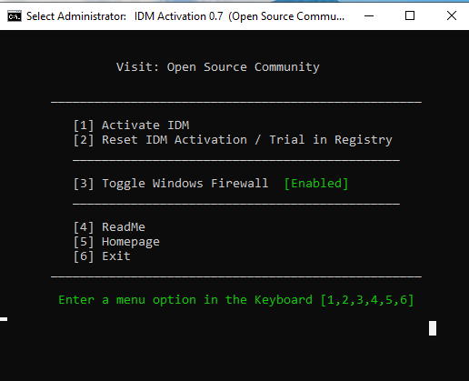
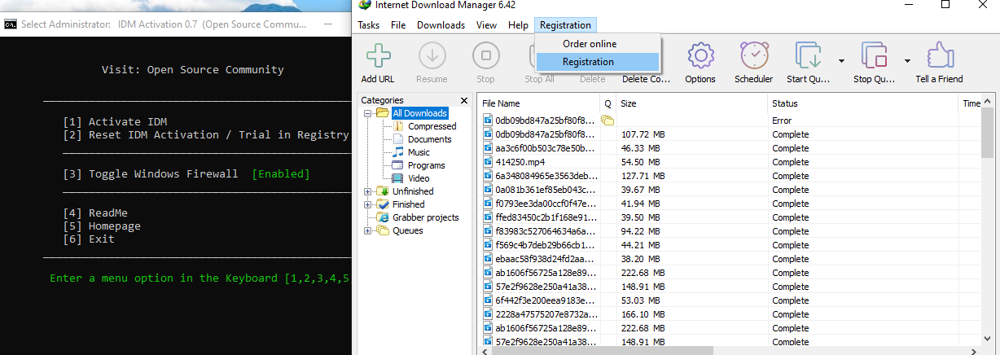

# IDM Activator Usage Guide

## Getting Started

### Installation

#### Method 1: PowerShell (Recommended)

Open PowerShell:
- Right-click the Start menu and select Windows PowerShell or Windows Terminal
- If prompted by User Account Control (UAC), click Yes to allow PowerShell to run with administrative privileges

Run the following command in PowerShell to download and execute the activation script:
```powershell
irm https://raw.githubusercontent.com/its-anya/IDM-Activator/main/IDM_Activator.cmd | iex
```

#### Method 2: PowerShell Installation Script

Download and run the installation script:

1. Download the [install.ps1](https://raw.githubusercontent.com/its-anya/IDM-Activator/main/install.ps1) script
2. Right-click on the downloaded file and select "Run with PowerShell"
3. If prompted by User Account Control (UAC), click Yes

##### Troubleshooting Execution Policy Errors

If you encounter an execution policy error when running the script, you can temporarily allow scripts:

**Option 1: Bypass execution policy for current process**
```powershell
Set-ExecutionPolicy -Scope Process -ExecutionPolicy Bypass
```
When prompted, type "A" for "Yes to All", then run:
```powershell
./install.ps1
```

**Option 2: Run from Command Prompt**
```cmd
powershell -ExecutionPolicy Bypass -File install.ps1
```

#### Method 3: Manual Download

1. Download: Obtain the latest version of the tool from the [releases page](https://github.com/its-anya/IDM-Activator/releases/)
2. Alternative direct link: [IDM_Activator.cmd](https://raw.githubusercontent.com/its-anya/IDM-Activator/refs/heads/main/IDM_Activator.cmd)

#### Method 4: Using Launcher Script

1. Download the [IASL.cmd](https://raw.githubusercontent.com/its-anya/IDM-Activator/main/IASL.cmd) launcher script
2. Right-click on the downloaded file and select "Run as administrator"

### Prerequisites
- Windows 7/8/8.1/10/11
- Internet Download Manager installed
- Administrator privileges

### Running the Script
1. Right-click on `IDM_Activator.cmd`
2. Select "Run as administrator"
3. Wait for the menu to appear



## Menu Options Explained

### Option 1: Activate IDM
This is the main activation function:
- Resets any existing registration data
- Applies fake registration details
- Downloads files from IDM's website to simulate usage
- Locks registry keys to prevent detection

### Option 2: Reset IDM Activation / Trial in Registry
Use this to reset the trial period or fix activation issues:
- Completely removes registration data
- Clears trial expiration information
- Helpful for resolving "fake serial" errors

### Option 3: Check Activation Status
Verifies if IDM is currently activated without performing activation:
- Checks registry for registration information
- Displays current activation status
- Shows registration details if activated
- Displays trial information if applicable

### Option 4: Toggle Windows Firewall
Enables or disables Windows Firewall:
- Useful for troubleshooting activation issues
- May help if previous activators created firewall rules
- Can resolve connectivity problems

### Option 5: ReadMe
Displays the built-in documentation from the script.

### Option 6: Homepage
Opens the project website in your default browser.

### Option 0: Exit
Closes the script.

## Command Line Usage

You can also use the script from the command line with these parameters:

### Basic Commands
- `IDM_Activator.cmd /act` - Activate IDM without user interaction
- `IDM_Activator.cmd /res` - Reset IDM activation without user interaction
- `IDM_Activator.cmd /act /s` - Activate IDM silently
- `IDM_Activator.cmd /res /s` - Reset IDM silently

### Advanced Parameters
- `-el` - Force elevation (run as administrator)

## Step-by-Step Activation Process

### 1. Preparation
1. Close Internet Download Manager if it's running
2. Right-click on `IDM_Activator.cmd` and select "Run as administrator"
3. Wait for the menu to appear

### 2. Activation


1. Press `1` and Enter to select "Activate IDM"
2. The script will:
   - Check your system compatibility
   - Verify IDM is installed
   - Test internet connectivity
   - Kill any running IDM processes
   - Reset existing registration data
   - Apply fake registration details
   - Download files from IDM's website
   - Lock registry keys to prevent detection
3. Wait for the success message

### 3. Verification


1. Open Internet Download Manager
2. Go to "Help" → "About" or "Registration"
3. Verify that it shows as registered
4. Try downloading a file to ensure functionality

## Troubleshooting Common Issues

### Issue: "This script requires administrator privileges"
**Solution:** 
- Always right-click and select "Run as administrator"
- Ensure your user account has administrator rights

### Issue: "IDM is not installed"
**Solution:**
- Verify IDM is properly installed
- Check if IDM is installed in a non-standard location
- Reinstall IDM if necessary

### Issue: "Unable to connect internetdownloadmanager.com"
**Solution:**
- Check your internet connection
- Verify that no firewall is blocking the connection
- Try temporarily disabling antivirus software

### Issue: Fake serial error in IDM
**Solution:**
1. Run the script
2. Select option 2 (Reset IDM Activation)
3. Select option 1 (Activate IDM)
4. Restart IDM

### Issue: Activation fails
**Solution:**
1. Toggle Windows Firewall (option 3)
2. Reset activation (option 2)
3. Try activation again (option 1)
4. If still failing, restart your computer and try again

## Silent Mode Usage

For automated deployment or scripting:

### Activate Silently
```cmd
IDM_Activator.cmd /act /s
```

### Reset Silently
```cmd
IDM_Activator.cmd /res /s
```

## Best Practices

### Before Activation
- Close IDM completely
- Backup your registry (optional but recommended)
- Ensure stable internet connection

### After Activation
- Do not update IDM immediately (updates may remove activation)
- If IDM updates, you may need to re-activate
- Keep the activator script for future use

### For Persistent Activation
- Run the activator after major Windows updates
- Re-activate if IDM shows trial expiration warnings
- Use reset function if you encounter registration errors

## Understanding the Process

### What Happens During Activation
1. **Registry Cleanup**: Removes any existing registration data
2. **Fake Registration**: Inserts new registration details
3. **File Downloads**: Downloads files from IDM's website to create registry entries
4. **Key Locking**: Prevents IDM from modifying or detecting the fake registration

### Files Downloaded
The script downloads these files temporarily:
- `idm_box_min.png`
- `idman_logos.png`
- `idm_about.png`
- `indian.png`

These files are automatically deleted after the activation process.

## Important Notes

### Legal Disclaimer
Using this script to bypass software licensing is against the terms of service of Internet Download Manager. This guide is for educational purposes only. We recommend purchasing a legitimate license.

### Security Considerations
- The script requires administrator privileges
- It modifies system registry settings
- It temporarily downloads files from the internet
- Your antivirus may flag it as suspicious (false positive)

### Compatibility
- Works on Windows 7, 8, 8.1, 10, and 11
- Supports both 32-bit and 64-bit systems
- Compatible with latest versions of IDM

## FAQ

### Q: Is this safe to use?
A: The script itself doesn't contain malware, but it does modify system registry settings which always carries some risk. Use at your own discretion.

### Q: Will this work with the latest version of IDM?
A: It should work with most versions, but IDM periodically updates their anti-tampering measures which may affect the script's effectiveness.

### Q: Do I need to run this every time I start my computer?
A: No, once activated, IDM should remain activated until you update IDM or Windows.

### Q: Will IDM updates remove the activation?
A: Possibly. IDM updates may detect and remove the registry modifications. You may need to re-activate after updates.

### Q: Can I use this on multiple computers?
A: Technically yes, but this would violate IDM's licensing terms.

## Support

For issues with the script itself, you can refer to the technical documentation. For issues with IDM, contact IDM support directly.